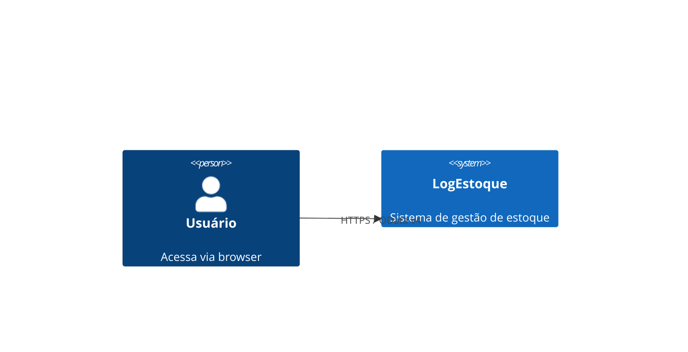
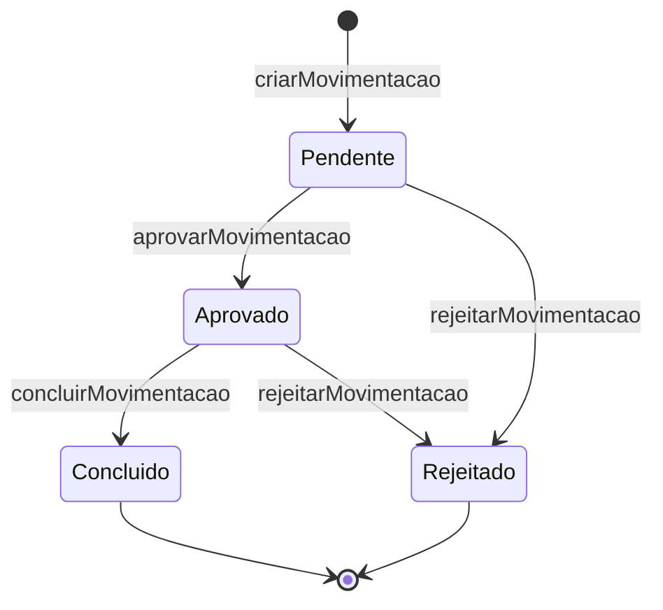

# Documentation Plan — LogEstoque

> Estratégia de documentação do projeto seguindo o padrão docs-as-code.

---

## 1. Princípios

- **Docs-as-code:** toda a documentação vive no repositório Git junto com o código
- **Markdown único:** todos os documentos em `.md` (CommonMark)
- **Diagramas como código:** Mermaid (renderizado no GitHub/GitLab) ou PlantUML
- **Documentação atualizada:** docs são atualizados no mesmo PR que o código
- **Sem redundância:** cada assunto documentado em um único lugar

---

## 2. Estrutura de Documentação

```
LogEstoque/
├── docs/                          ← Documentação de planejamento e arquitetura
│   ├── requirements.md            ← Requisitos funcionais, NFRs, atores, regras de negócio
│   ├── architecture.md            ← Padrão arquitetural, diagramas C4, ADRs
│   ├── technology-stack.md        ← Stack, versões, dependências, configuração
│   ├── security.md                ← Autenticação, autorização, OWASP, checklist
│   ├── testing.md                 ← Pirâmide de testes, cobertura, exemplos
│   ├── infrastructure.md          ← Docker, Nginx, CI/CD, backup, observabilidade
│   └── documentation-plan.md     ← Este arquivo
│
├── srv/                           ← Código documentado inline (JSDoc)
├── db/                            ← Entidades CDS documentadas com comentários
├── app/logestoque/                ← App Fiori documentado inline (TSDoc)
└── test/http/                     ← Testes manuais autodocumentados (.http files)
```

---

## 3. Documentação por Camada

### 3.1 Modelo de Dados (`db/*.cds`)

Cada entidade documentada com comentário CDS `/** */`:

```cds
/**
 * Posição atual de estoque: quantidade de um material em um armazém.
 * A combinação (material, warehouse) é única.
 * `quantity` nunca pode ser negativo.
 */
entity Stocks : cuid, managed {
    material  : Association to one masterdata.Materials;
    warehouse : Association to one masterdata.Warehouses;
    quantity  : Integer @assert.range: [0, _];
}
```

### 3.2 Serviços (`srv/*.js`)

Handlers documentados com JSDoc:

```javascript
/**
 * Conclui uma movimentação aprovada, atualizando Stocks e criando StockHistory.
 * @param {cds.Request} req - Requisição CAP com `movimentID`
 * @returns {Promise<Object>} Movimentação atualizada com status 'C'
 * @throws {Error} 404 se movimentação não encontrada
 * @throws {Error} 409 se status != 'A'
 */
async function onConcluirMovimentacao(req) { ... }
```

### 3.3 Controllers UI5 (`app/.../controller/*.ts`)

TSDoc nos controllers TypeScript:

```typescript
/**
 * Controller da tela de login.
 * Gerencia autenticação via POST /auth/login e armazena JWT no sessionStorage.
 * @namespace br.dev.imlucas.logestoque.controller
 */
export default class LoginController extends Controller { ... }
```

### 3.4 Anotações CDS (`app/.../annotations.cds`)

Comentários explicando o propósito de cada bloco de anotações:

```cds
// ── MovimentByWarehouse: List Report ─────────────────────────
// Campos visíveis na lista; botões de ação condicionais por status
annotate service.MovimentByWarehouse with @(UI.LineItem: [...]);
```

---

## 4. Documentação da API OData

### 4.1 Autodocumentação via CAP

O `@sap/cds` gera automaticamente:
- **$metadata** OData: `GET /odata/v4/main/$metadata` (esquema XML completo)
- **Fiori Elements**: UI gerada pelas anotações documenta implicitamente o modelo

### 4.2 Arquivos HTTP como documentação executável

Os arquivos `test/http/*.http` servem como documentação viva da API:

| Arquivo | Documenta |
|---|---|
| `test/http/auth.http` | Endpoints de autenticação com exemplos de request/response |
| `test/http/moviments.http` | Ações de movimentação com payloads de exemplo |
| `test/http/distribution-centers.http` | CRUD de centros de distribuição |
| `test/http/users.http` | CRUD de usuários (requer ADMIN) |

**Convenção:** Cada request inclui comentário `###` descrevendo o caso de uso e o status esperado.

### 4.3 Documentação OpenAPI (futuro)

Para evolução futura dos endpoints REST (`/auth/*`), considerar:
- `@sap/cds-openapi` para gerar spec OpenAPI 3.0 a partir dos serviços CDS
- Swagger UI servido em `/api-docs` (apenas em desenvolvimento)

---

## 5. Diagramas

### 5.1 Diagrama de Contexto (C4 Nível 1) — em `architecture.md`



### 5.2 Diagrama ER — em `architecture.md`

Diagrama textual ASCII no `architecture.md` representando as entidades e relacionamentos principais.

### 5.3 Fluxo de Status — em `requirements.md`

Diagrama Mermaid do fluxo de aprovação de movimentações:



---

## 6. Convenções de Escrita

| Elemento | Convenção |
|---|---|
| Títulos | `# H1` para arquivo; `## H2` para seções; `### H3` para subseções |
| Código | Usar code blocks com linguagem (`` ```cds ``, `` ```javascript ``, `` ```bash ``) |
| Tabelas | Para comparações, listas de parâmetros, mapeamentos |
| Avisos | `**Atenção:**` ou `**Nota:**` em negrito para avisos importantes |
| TODOs | `// TODO:` no código; issue no repositório para itens pendentes |
| Idioma | Português (BR) para documentação; inglês para código e comentários técnicos |

---

## 7. Ciclo de Vida da Documentação

1. **Nova feature/decisão:** atualizar o documento relevante no mesmo PR
2. **Revisão:** documentação revisada junto com o código no code review
3. **Deprecated:** marcar seção como `> **Deprecated:** ...` antes de remover
4. **ADRs:** decisões arquiteturais relevantes documentadas como seções em `architecture.md`

---

## 8. Referências Externas

| Documento | URL |
|---|---|
| SAP CAP Docs | https://cap.cloud.sap/docs/ |
| SAP Fiori Elements Docs | https://sapui5.hana.ondemand.com/sdk/#/topic/03265b0408e2432c9571d6b3feb6b1fd |
| `@cap-js/postgres` | https://www.npmjs.com/package/@cap-js/postgres |
| SAPUI5 API Reference | https://sapui5.hana.ondemand.com/sdk/#/api |
| UI5 Tooling | https://sap.github.io/ui5-tooling/ |
| `cds-plugin-ui5` | https://github.com/ui5-community/cds-plugin-ui5 |
| OWASP Top 10 | https://owasp.org/www-project-top-ten/ |
